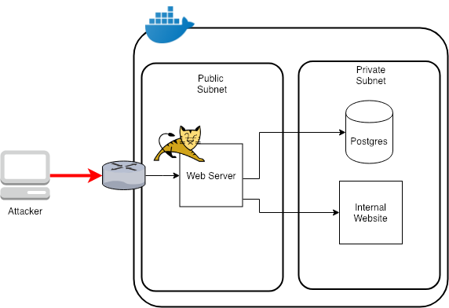

# Vulnado - Intentionally Vulnerable Java Application

This application and exercises will take you through some of the OWASP top 10 Vulnerabilities and how to prevent them.

## Up and running

Server will be running on localhost:8080

```
docker-compose up
```

## Architecture

The docker network created by `docker-compose` maps pretty well to a multi-tier architecture where a web server is publicly available and there are other network resources like a database and internal site that are not publicly available.



## Exercises

* [SQL Injection](exercises/01-sql-injection.md)
* [SSRF - Server Side Request Forgery](exercises/02-ssrf.md)
* [RCE - Remote Code Execution & Reverse Shell](exercises/04-rce-reverse-shell.md)
